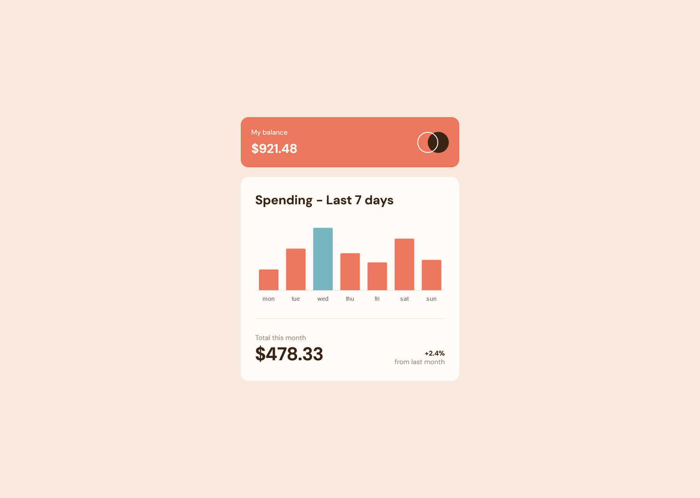
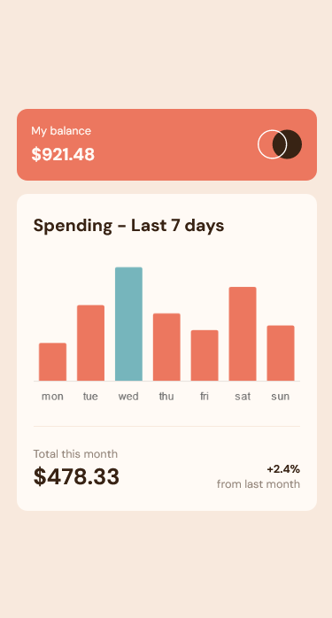

# Frontend Mentor - Expenses chart component solution 🚀


## Welcome 👋

This is a solution to the [Expenses chart component challenge on Frontend Mentor](https://www.frontendmentor.io/challenges/expenses-chart-component-e7yJBUdjwt). Frontend Mentor challenges help you improve your coding skills by building realistic projects.

## Table of contents 📑

- [Overview 🌟](#overview-🌟)
  - [The Challenge 🧪](#the-challenge-🧪)
  - [Screenshots 📷](#screenshots-📷)
  - [Links 🔗](#links-🔗)
- [My process 🏗️](#my-process-🏗️)
  - [Built with 🛠️](#built-with-🛠️)
  - [What I learned 🧠](#what-i-learned-🧠)
  - [Useful resources 📚](#useful-resources-📚)
- [Contact 📧](#contact-📧)
- [Author 👤](#author-👤)

## Overview 🌟

### The Challenge 🧪

Users should be able to:

- ✅ View the bar chart and hover over the individual bars to see the correct amounts for each day

  - _Currently, chart.js does not support customizable tooltips(atleast that I am aware of) so I am simply using their own in-built tooltips, meaning it does not match the design_

- ✅ See the current day’s bar highlighted in a different colour to the other bars
- ✅ View the optimal layout for the content depending on their device’s screen size
- ✅ See hover states for all interactive elements on the page
- ✅ **Bonus**: Use the JSON data file provided to dynamically size the bars on the chart

### Screenshots 📷

_My solution (Desktop):_



_My solution (Mobile)_



### Links 🔗

- Solution repo on Github: [here](https://github.com/BeanyTheCoder/expenses-chart-component-main)
- Solution link on Front End Mentor: [here](https://www.frontendmentor.io/solutions/expenses-chart-component-MUHwPg-Ib7)

## My process 🏗️

### Built with 🛠️

- HTML & CSS
- JavaScript
- Chart.js(link [here](https://www.chartjs.org/))

### What I learned 🧠

I learned a lot about chart.js and their syntax.

```js
// placholder for chart.js code
```

### Useful resources 📚

- I recommend reading the [Chart.js docs](https://www.chartjs.org/docs/latest/) to try to wrap your head around it and how it works.

## Contact 📧

- Frontend Mentor - [@BeanyTheCoder](https://www.frontendmentor.io/profile/BeanyTheCoder)
- Github - [BeanyTheCoder](https://github.com/BeanyTheCoder)

## Author 👤

My name is Alexander Afoko Jnr. and I am a passionate 13-year-old frontend developer from Ghana.
I hope to build up my portfolio and take my skills to the next level.
